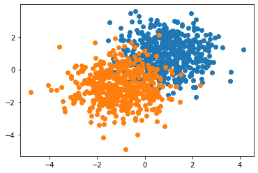
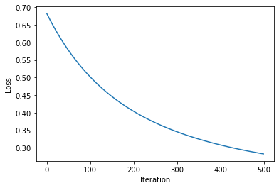
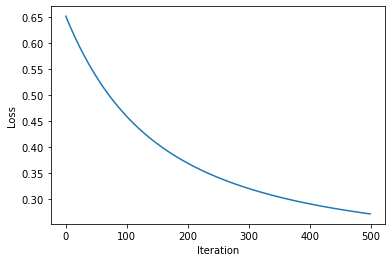

# TensorFlow Tutorial

There are a lot of TensorFlow tutorials. I found the easy-to-find ones lacking in detail about what is going on behind the abstractions used in TF. My goal here is to present an exercise, analogous to this [`flux.jl` introduction](https://fluxml.ai/Flux.jl/stable/models/basics/) that builds up from close to scratch to illustrate the different abstractions.  

I used TF 2.3.1 for this. It assumes familiarity with Python and with gradient based neural network training, but not with TF.

## Data

First, we will make up some simple fake data and plot it:

```python
import tensorflow as tf

from sklearn.datasets import make_blobs
import matplotlib.pyplot as plt
import numpy as np

# made up data
centers = [[1, 1], [-1, -1]]
X, y = make_blobs(n_samples=1000, centers=centers, cluster_std=1)

# plot
for k in set(y):
    x = [x[0] for x,l in zip(X,y) if l==k]
    label = [x[1] for x,l in zip(X,y) if l==k]
    plt.scatter(x,label)
    
plt.show()
```



Our input, X is a list of 2D vectors, and our output is a list of 1's or 0's representing two different class labels corresponding to the orange and blue points in the plot.

## Training with TF/Keras

Now, here is an example training a linear model on this data that roughly mirrors a lot of TF tutorials:

```python
model = tf.keras.models.Sequential([tf.keras.layers.Dense(1,input_shape=(2,))])
model.compile(optimizer='SGD',
    loss=tf.keras.losses.BinaryCrossentropy(from_logits=True),
    metrics=['accuracy'])
model.fit(X,y,batch_size=100,epochs=20)

Out[]: 

Epoch 1/20
10/10 [==============================] - 0s 955us/step - loss: 0.9161 - accuracy: 0.3250
Epoch 2/20
10/10 [==============================] - 0s 2ms/step - loss: 0.8414 - accuracy: 0.3880
...
Epoch 20/20
10/10 [==============================] - 0s 1ms/step - loss: 0.3626 - accuracy: 0.8580
```

TF/Keras does a lot for us here, but I never found it very satisfying following this kind of example. Reducing it to API calls means that understanding what is going on becomes about reading the API - this is not necessarily bad but for beginners it takes away any intuition about what is happening and why, and what to do if you wanted to change anything[^1]. 

[^1]For example, when I was writing this, I started by copying the `model.compile(loss='sparse_categorical_cross_entropy'...)` line from another tutorial. I wanted binary cross entropy, and I wanted it from logits, so I had to read the API to learn that specifying the loss with 'binary_cross_entropy' as a string assumes the output is a probability, but that I can instead specify the loss as an object as I did in the example above. Not a big deal, but not super intuitive either, especially if you are not sure what you are looking for.

## The longer way

So, let's try to use TF as little as possible.

We cast the training data to TF constants as follows:

```python
X = tf.constant(X,dtype=tf.float32)
y = tf.constant(y,dtype=tf.float32)
```

We can make the same linear model as above linear model (that gives a probability as an output) by writing a function directly:

```python
# Outputs probability of a label being '1'
def predict(W, b, inputs):
    return tf.reshape(
        tf.nn.sigmoid(
            tf.add(
                tf.matmul(inputs, W), b)),(inputs.shape[0],))
```

Here we expect `W` to be a 2x1 vector of weights, and `b` to be a scalar bias. You can see that the math - just combining the elements of `X` according to the weights and adding the bias, is done using TF operations (`add`, `matmul`).

We can randomly initialize the model parameters and make a prediction as follows:

```python
W = tf.reshape(tf.constant(np.random.randn(2),dtype=tf.float32),(2,1))
b = tf.constant(np.random.randn(),dtype=tf.float32)

predict(W,b,X)[0:10]

Out[]: <tf.Tensor: shape=(10,), dtype=float32, numpy=
array([0.5210591 , 0.9974555 , 0.63289624, 0.8091879 , 0.846755  ,
       0.71606183, 0.03832325, 0.95016336, 0.8294958 , 0.17246142],
      dtype=float32)>
```

Here we explicitly write out the formula for binary cross entropy. To be sure, it is more work and more error prone, and there may be problems running it on a GPU, but we can see exactly what it is doing. We can also create a simple accuracy function:

```python
inputs = X
targets = y
def loss(W, b):
    preds = predict(W, b, inputs)
    label_probs = tf.math.add(
        tf.math.multiply(preds,targets),
        tf.math.multiply(1 - preds,1 - targets))
    return tf.reduce_mean(-tf.math.log(label_probs+.0001))

def accuracy(W,b):
    preds = np.array(predict(W, b, inputs))
    return sum(np.round(preds)==np.array(targets))/len(preds)
```

```python
loss(W,b)

Out[]: <tf.Tensor: shape=(), dtype=float32, numpy=0.6823132>

accuracy(W,b)

Out[]: 0.653

```

So the only thing we really want to use TF for at this point is to get the gradients. This is done using a `tf.GradientTape()` to watch the model parameters as we calculate the loss:

```python
def grad(W,b):
    with tf.GradientTape() as tape:
        tape.watch(W)
        tape.watch(b)
        loss_value = loss(W,b)
    
    return loss_value, tape.gradient(loss_value, (W,b))
```

```python
grad(W,b)

Out[]: (<tf.Tensor: shape=(), dtype=float32, numpy=0.6823132>,
 (<tf.Tensor: shape=(2, 1), dtype=float32, numpy=
  array([[0.3967318 ],
         [0.17694217]], dtype=float32)>,
  <tf.Tensor: shape=(), dtype=float32, numpy=0.2413591>))
```

Above we see the loss repeated again (the first element of the tuple), and gradients for the three parameters. 

For training, we do the normal thing of repeatedly calculating gradients, and moving the parameters incrementally against them.

```python
rate = 0.01

loss_plot = []
for steps in range(500):
    loss_value, grads = grad(W,b)
    W = W - rate * grads[0]
    b = b - rate * grads[1]
    
    loss_plot.append(loss_value)
    
plt.plot(loss_plot)
plt.xlabel("Iteration")
plt.ylabel("Loss")
plt.show()
print (f"loss is {loss_plot[-1]}")
``` 

 


## Backing off

There may be reasons you don't want to write your own layers or optimizer or loss functions. We can trivially add them back in depending on the level we want to work at:

__Layers__

A Keras layer can be implemented by extending the `tf.keras.layers.Layer` class. This is covered by a tutorial in the [TF documentation](https://www.tensorflow.org/tutorials/customization/custom_layers), but briefly we need to define `__init__`, `build` and `call` functions that set up the layer and implement it's internal logic:

```python
class MyDense(tf.keras.layers.Layer):
    def __init__(self, num_outputs):
        super(MyDense, self).__init__()
        self.num_outputs = num_outputs
    
    def build(self, input_shape):
        self.W = self.add_weight("W",
            shape=[int(input_shape[-1]), 
            self.num_outputs])
        self.b = self.add_weight("b",shape=[self.num_outputs])
        
    def call(self, input):
        return tf.add(tf.matmul(input,self.W),self.b)
```

The layer needs to be instantiated with an output length specified and called with an appropriately shaped input in order to work:

```python
la = MyDense(1)
la(tf.zeros([1,2]))
la.trainable_variables

Out[]: [<tf.Variable 'my_dense_9/W:0' shape=(2, 1) dtype=float32, numpy=
 array([[-0.71072465],
        [-0.13644254]], dtype=float32)>,
 <tf.Variable 'my_dense_9/b:0' shape=(1,) dtype=float32, numpy=array([-1.4446912], dtype=float32)>]

la(X)

Out[]:

<tf.Tensor: shape=(1000, 1), dtype=float32, numpy=
array([[-2.67831850e+00],
       [-1.41732955e+00],
       [-1.46409166e+00],
       [-2.22594595e+00],
...
``` 

Note that we can also access the parameters as `la.W` and `la.b`.

__Model__

To use Keras functionality we wrap the layers in a `tf.keras.Model`. A basic one that uses the `MyDense` layer we created is shown below:

```python
class MyModel(tf.keras.Model):
    def __init__(self):
        super(MyModel, self).__init__(name='')
        
        self.dense = MyDense(1)
        _ = self.dense(tf.zeros([1,2]))
        
    def call(self, input_tensor, training=False):
        x = self.dense(input_tensor)
        return x
```

```python
mm = MyModel()
mm.layers

Out[]: [<__main__.MyDense at 0x7fa823c245e0>]
```

Here the model does not take any inputs and we have hard coded in the layer shape, but the `__init__` function can also take inputs. See the TF tutorial linked above for a more comprehensive example of a custom model. The point here is that we have created a minimum model we can use with an optimizer. 

__Loss__

We can use Keras internal loss objects to return a loss. This is equivalent to the earlier loss function that was written out explicitly. 

```python
def loss(model, x, y):
    preds = tf.reshape(tf.nn.sigmoid(model(x)),(x.shape[0],))
    targets = y
    return tf.keras.losses.BinaryCrossentropy()(y_true=y, y_pred=preds)
```


__Optimizer__

Keras provides optimizers that we can instantiate and use to apply gradients:

```python
optimizer = tf.keras.optimizers.SGD(learning_rate=0.01)
```

We also need to redefine the gradient to account for our newly created model:

```
def grad(model, inputs, targets):
    with tf.GradientTape() as tape:
        tape.watch(model.trainable_variables)
        loss_value = loss(model, inputs,targets)
    
    return loss_value, tape.gradient(loss_value, model.trainable_variables)
```

And now we can train the model by calculating a gradient and using the optimizer to apply it to the model parameters.

```python
for steps in range(500):
    loss_value, grads = grad(mm, X, y)
    optimizer.apply_gradients(zip(grads, mm.trainable_variables))
    
    loss_plot.append(loss_value)

```



An additional thing that the Keras boilerplate takes care of it the batching of inputs, not covered here, but easy to add if you understand the manual training process.

In conclusion, we started with some pretty standard TF/Keras functions to train a model:

```python
model = tf.keras.models.Sequential([tf.keras.layers.Dense(1,input_shape=(2,))])
model.compile(optimizer='SGD',
    loss=tf.keras.losses.BinaryCrossentropy(from_logits=True),
    metrics=['accuracy'])
model.fit(X,y,batch_size=100,epochs=20)
```

We showed how to build up to this level of abstraction from "scratch", using only automatic differentiation. For some experience levels and backgrounds, I hope that understanding this buildup is helpful as a first step to learning how to use TF, and can provide additional insight compared to just learning the API.

Please let me know if you have any questions or comments! 
 
